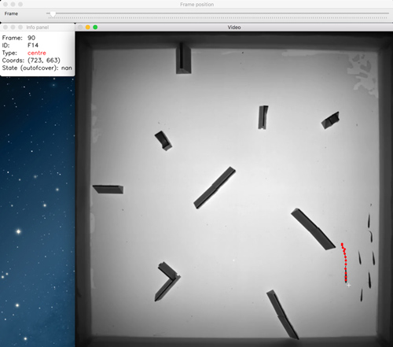

# ManTrack
**A standalone manual tracking package**



*ManTrack* is the standalone version of the manual tracking functionality
that is part of the (still private) AnimTrack package by J.W.Jolles. To see *ManTrack* in action, watch the video [here](https://www.youtube.com/watch?v=W6H6J0QbukkO)


Setting-up mantrack
------------
<em>This guide is written for Mac OS.</em>

### Install python
To use mantrack, first you will need to install python on your system if it does not exist already. On mac this is easiest with Homebrew.

1) First we will need to install Apple's Xcode. Open a terminal window by going to Find and typing in "terminal". Then in the newly opened terminal window enter:

`xcode-select --install`

Make sure to click through all the subsequent confirmation commands.

2) Next, install Homebrew by entering in terminal:

`/usr/bin/ruby -e "$(curl -fsSL https://raw.githubusercontent.com/Homebrew/install/master/install)"`

To confirm Homebrew installed correctly, run this command:

`brew doctor`

3) Now install python 3 very easily:

`brew install python3`

### Install python dependencies
Mantrack makes use of four dependencies that need to be installed.

1) First of all, pip is the main package manager for python that we will also use to install opencv. Pip should already be installed on your system. You can test this by typing `pip -V` in the terminal window. If it shows pip with a version number you have pip installed. If it’s not, we can install it with wget. Open a Terminal window and enter:

`wget https://bootstrap.pypa.io/get-pip.py`

Now to install pip for Python 3 enter:

`sudo python3 get-pip.py`

2) Next we are going to install the pandas and numpy packages. Open a terminal window and enter:

`pip install pandas numpy`

3) Installing opencv used to be a huge pain. However, it became a lot simpler only last month and opencv is now easily installable with pip:

`sudo pip install opencv-contrib-python`

Now let’s just make sure that OpenCV is working. Open a terminal window and enter `python3` to start Python. Now while inside Python type in the following two commands to make sure you have installed OpenCV correctly:

```
import cv2
cv2.__version__
```

Your terminal window should look like (or similar like):

```
$ python3
Python 3.5.3 (default, Sep 27 2018, 17:25:39)
[GCC 6.3.0 20170516] on linux
Type "help", "copyright", "credits" or "license" for more information.
>>> import cv2
>>> cv2.__version__
'3.4.4'
```

4) Mantrack makes use of my [animlab](https://github.com/jollejolles/AnimLab) package that consists of a large range of helper functions. To install this package, run:

`pip install git+https://github.com/JolleJolles/animlab.git`

5) Now finally we can install ManTrack. Open a terminal window and enter:

```bash
pip install git+https://github.com/JolleJolles/mantrack.git
```

Using mantrack
------------
The easiest way to use Mantrack is with jupyter, an interactive python interpreter, although it can also be run with a standalone python script. To install jupyter, open a terminal window and enter:

`pip install jupyter`

Now to start jupyter simply enter:

`jupyter notebook`

A helper jupyter notebook file is provided in the ManTrack packe [here](https://github.com/JolleJolles/mantrack/run_mantrack.ipynb). The template file consists of cells with python commands and detailed description that should help you manually track your videos. Especially read the documentation and considerations carefully to know which parameters to set and how to use Mantrack.
